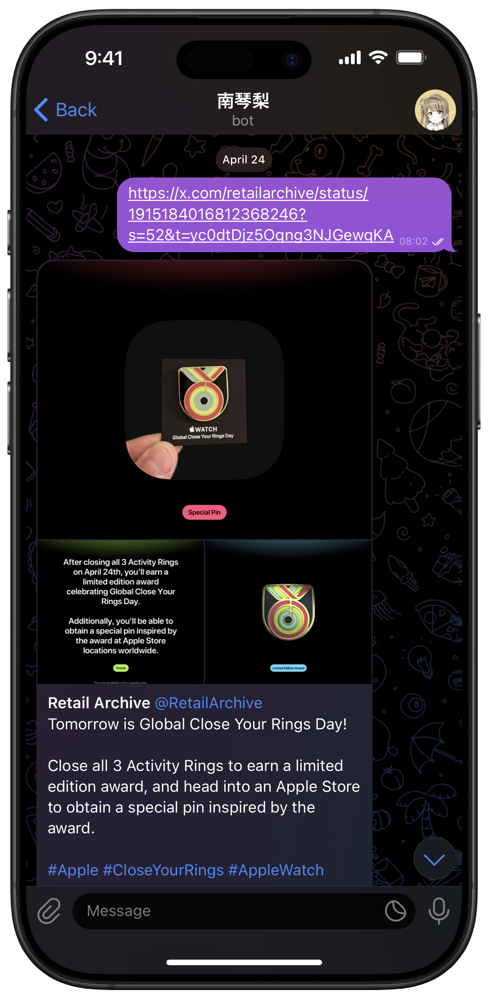
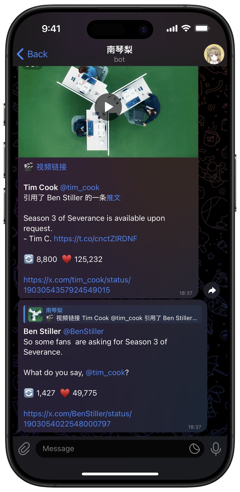

# twitter-telegram-preview-bot


一个推文预览 Telegram 消息生成工具。

完整功能已在 [@kotorixbot](https://t.me/kotorixbot) 中实现，可以直接使用，此为该项目源代码。

## 效果图

| 支持图片、视频                   | 支持引用、回复                      | Inline 美化 URL                    |
| -------------------------------- | ----------------------------------- | ---------------------------------- |
|  |  |  |

## 搭建使用

已改为使用 [dylanpdx/BetterTwitFix](https://github.com/dylanpdx/BetterTwitFix) 提供的接口进行实现，相较原先的版本几乎无功能性损失，同时提供更高的稳定性，也无需再安装 Twitter 相关的 PyPI 依赖。

你需要使用至少 Python 3.12 版本才能运行此代码。

* [aiohttp](https://github.com/aio-libs/aiohttp): 异步网络请求
* [python-telegram-bot](https://github.com/python-telegram-bot/python-telegram-bot): Python Telegram Bot 包装

通过 pypi 安装全部依赖:

``` shell
python3 -m pip install -r requirements.txt
```

通过 [@BotFather](https://t.me/botfather) 申请你自己的 Bot，然后将 Token 填写在 [BotApp.py](BotApp.py) 中。
